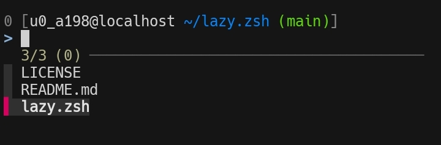

# 💥 Bash config



## 🛠 Quick Guide

### 📦 Prerequisites

- bash
- git
- [fzf](https://github.com/junegunn/fzf)
- [fd](https://github.com/sharkdp/fd)

  ```sh
  sudo apt install bash bash-completion git fzf fd
  ```

### ⚡ Setup

- Backup your `.bashrc`, if any:

  ```sh
  mv -v ~/.bashrc ~/.bashrc.bak
  ```

- Clone the repository to your local machine:

  ```sh
  git clone --depth=1 https://github.com/ndachj/dotf; cd dotf
  ```

- Copy the `.config/bash` directory to `~/.config`:

  ```sh
  export BDOTDIR="$HOME/.config/bash"
  mkdir -p $BDOTDIR
  cp -rv .config/bash ~/.config
  ```

- Symlink `.profile` to `~/.bash_profile`:

  ```sh
  ln -sf "$BDOTDIR/.profile" ~/.bash_profile
  ```

- Change the default login shell:

  ```sh
  sudo chsh ${USER} -s /bin/bash
  ```

- Now logout and login back for changes to take effect.

## ⌨️ Hacking

### 🌐 plugins

- [bash-prompt-generator](https://github.com/Scriptim/bash-prompt-generator)

- [git-prompt.sh](https://github.com/git/git/blob/master/contrib/completion/git-prompt.sh)

- git-completion.bash

### 📂 File Structure

<pre>
~/.config/bash
  ├── .bashrc
  ├── git-completion.bash
  └── git-prompt.sh
</pre>

### 💤 Uninstall

<details><summary>To uninstall bash config</summary>

- Remove the `$BDOTDIR` and `.bash_profile`:

  ```sh
  rm -rfv "$BDOTDIR" ~/.bash_profile
  ```

- Then **restore** your original `.bashrc`:

  ```sh
  mv ~/.bashrc.bak ~/.bashrc
  ```

</details>
