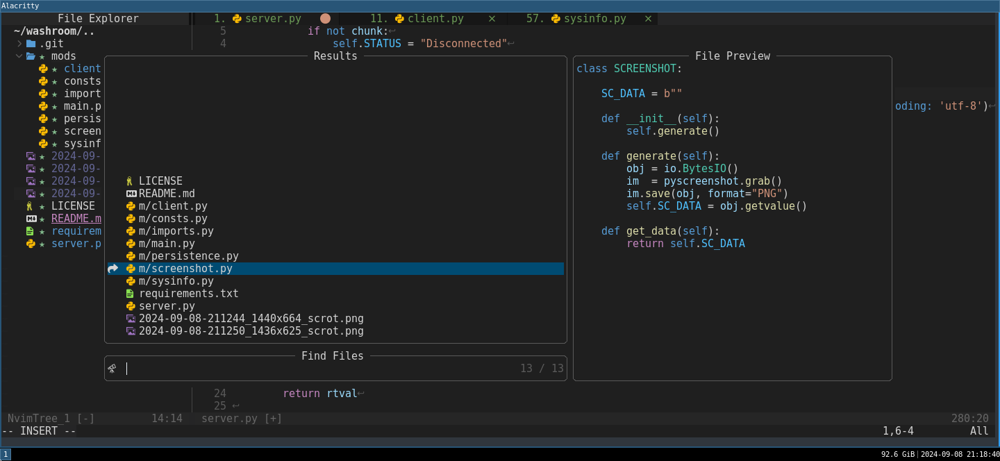

# 💥 Ndachj's neovim config




Simple and modern Neovim configuration

## 🛠 Quick Guide

### 📦 Requirements

1. neovim (needs to be built with **LuaJIT**)
2. git (for partial clones support)
3. [fd](https://github.com/sharkdp/fd) (required by Telescope.nvim)
4. [ripgrep](https://github.com/BurntSushi/ripgrep) (required by Telescope.nvim)
5. nodejs (required by coc.nvim)
6. gcc or clang (for compiling Treesitter parser) - See [here](https://github.com/nvim-treesitter/nvim-treesitter#requirements)

   ```sh
   # On Ubuntu or Debian
   sudo apt install neovim git fd ripgrep nodejs
   ```

### ⚡️ Optional

- Nerd font (Font that supports icons)
  [get Nerd font](https://github.com/getnf/getnf)

- Add clipboard support:

  ```sh
  # On Ubuntu or Debian
  sudo apt install xsel         # for X11
  sudo apt install wl-clipboard # for wayland
  ```

- Add Neovim Python 3 support:

  ```sh
  python3 -m pip install pynvim
  ```

- Add Neovim Node.js support:

  ```sh
  npm install -g neovim
  ```

### ⚡ Setup

- Backup your `nvim` config, if any:

  ```sh
  mv -v ~/.config/nvim ~/.config/nvim.bak
  ```

- Remove the old **nvim plugins**, if any:

  ```sh
  rm -rfv ~/.local/share/nvim
  ```

- Clone the repository to your local machine:

  ```sh
  git clone --depth=1 https://github.com/ndachj/dotf; cd dotf
  ```

- Copy the `.config/nvim` directory to `~/.config`:

  ```sh
  cp -rv .config/nvim ~/.config
  ```

Run `nvim` without any arguments and wait for the plugins to be installed.

### ✅ Check Health

Open `nvim` and run `:checkhealth` to ensure the configuration, performance, python support, clipboard support, and more are working properly.

```vim
:checkhealth
```

## ⌨️ Hacking

### 📂 File Structure

<pre>
~/.config/nvim
    ├── lua
    │   ├── configs
    │   │   └── coc_nvim_config.lua
    │   ├── core
    │   │   ├── autocmds.lua
    │   │   ├── keymaps.lua
    │   │   ├── lazy_nvim.lua
    │   │   └── options.lua
    │   ├── extra
    │   │   └── icons.lua
    │   └── plugins
    │       ├── coc_nvim.lua
    │       ├── ...
    │       ├── nvim_telescope.lua
    │       └── nvim_whichkey.lua
    ├── coc-settings.json
    └── init.lua
</pre>

### 🔥 LSP

To turn neovim from a **text editor** to an **IDE**, I choose [coc.nvim](https://github.com/neoclide/coc.nvim) as the LSP over the native LSP because it is easy to setup and has more established plugins/extensions. CoC provides language server integrations, autocompletion, linting, and formatting all in one easy use package.

> [!NOTE]
> coc.nvim doesn't come with support for any specific language. You need to install coc-extensions for the language.

For example, to install a coc-extension for **python**, run:

```vim
:CocInstall coc-pyright
```

I have already defined some global coc-extensions to be installed automatically on start up. Please make changes according to your workflow.

```lua
vim.g.coc_global_extensions = { "coc-pairs", "coc-git", "coc-json", "coc-prettier", "coc-snippets","coc-sumneko-lua", "coc-pyright", "coc-sh", "coc-marketplace", "coc-markdownlint", "coc-cmake" }
```

To discover coc-extensions use the [coc-marketplace](https://github.com/fannheyward/coc-marketplace)

### 🔎 Missing Features

**coc.nvim** doesn't provide debugging capabilities. Please see [vimspector](https://github.com/puremourning/vimspector) for such features.

### 💤 Uninstall

<details><summary>To uninstall Ndachj's nvim config</summary>

- Remove the `nvim` config:

  ```sh
  rm -rfv ~/.config/nvim
  ```

- Remove the **nvim plugins**:

  ```sh
  rm -rfv ~/.local/share/nvim
  ```

- Then **restore** your original `nvim` config:

  ```sh
  mv -v ~/.config/nvim.bak ~/.config/nvim
  ```

</details>

## 🎨 Theme

[vscode](https://github.com/Mofiqul/vscode.nvim) - Lua port of vim-code-dark colorscheme for neovim with VScode's light and dark theme.

## 👑 Acknowledgements

[Neovim-from-scratch](https://github.com/LunarVim/Neovim-from-scratch) - Neovim config designed from scratch to be understandable.

[awesome-neovim](https://github.com/rockerBOO/awesome-neovim) - Collections of awesome Neovim plugins. Mostly targeting Neovim specific features.
