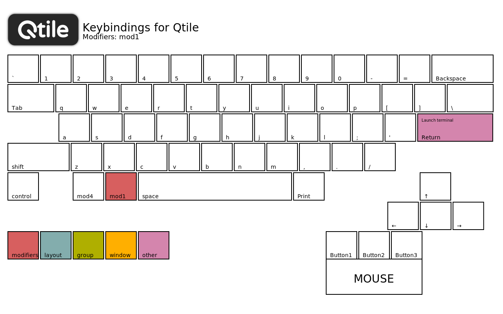
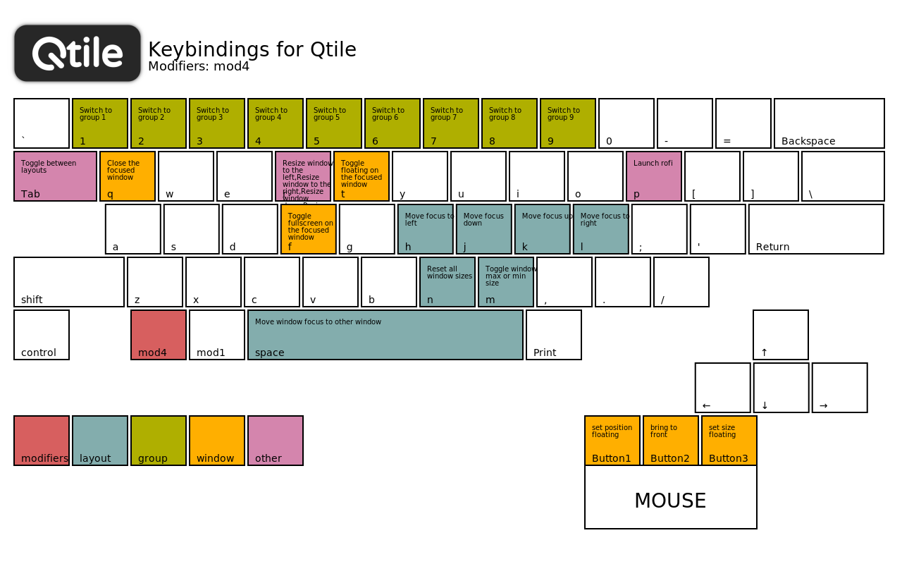
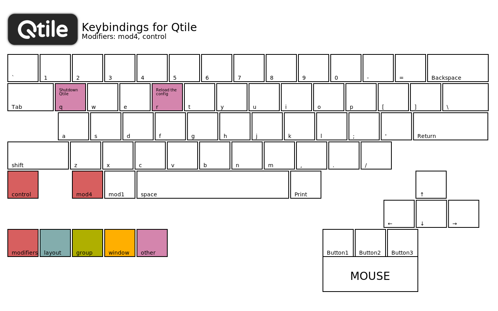
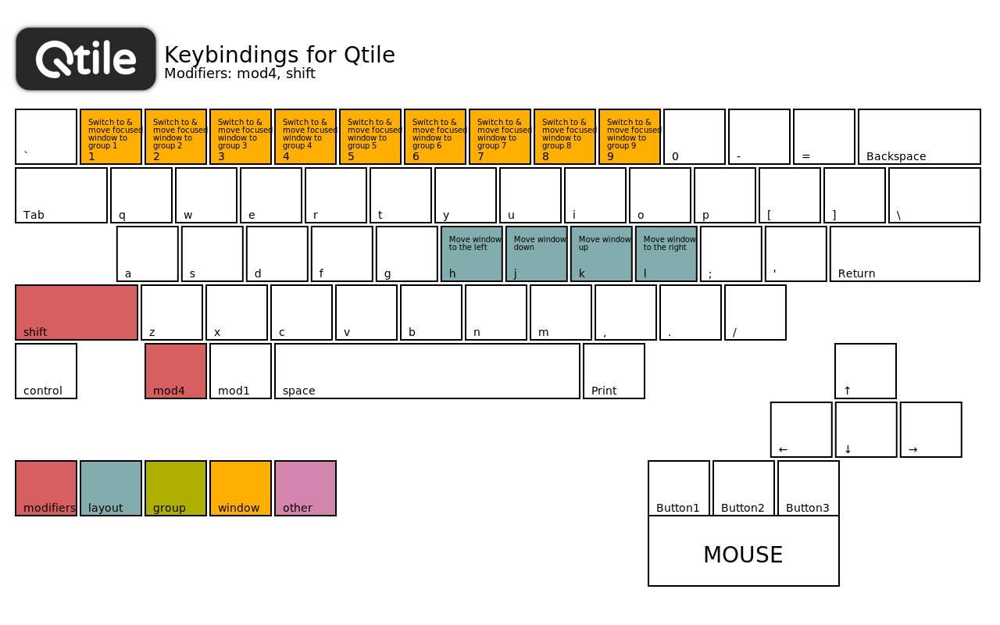

# Qtile config

TreeTab layout

[Qtile](https://github.com/qtile/qtile) - Qtile is a full-featured, hackable tiling window manager written and configured in Python. It's available both as an X11 window manager and also as
a Wayland compositor.

[Installation](https://docs.qtile.org/en/stable/manual/install/index.html)

[Documentation](https://docs.qtile.org/en/stable)

[Real-world configurations](https://github.com/qtile/qtile-examples)

Log file: `~/.local/share/qtile/qtile.log`

Default configuration: `/usr/lib/python3.XX/site-packages/libqtile/resources/default_config.py`

Check a configuration file for errors: `qtile check`

## ⌨️ Keybindings

