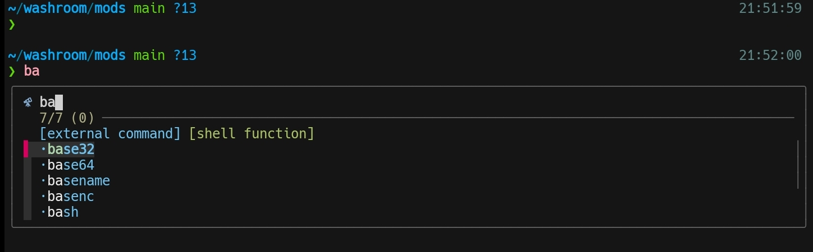
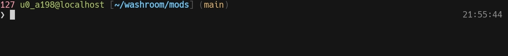

# 💥 Ndachj's zsh config




## 🛠 Quick Guide

### 📦 Prerequisites

- [zsh](https://github.com/zsh-users/zsh)
- git
- [fzf](https://github.com/junegunn/fzf)

  ```sh
  sudo apt install zsh git fzf
  ```

### ⚡ Setup

- Backup your `.zshrc`, if any:

  ```sh
  mv -v ~/.zshrc ~/.zshrc.bak
  ```

- Clone the repository to your local machine:

  ```sh
  git clone --depth=1 https://github.com/ndachj/dotf; cd dotf
  ```

- Copy the `.config/zsh` directory to `~/.config`:

  ```sh
  export ZDOTDIR="$HOME/.config/zsh"
  mkdir -p $ZDOTDIR
  cp -rv .config/zsh ~/.config
  ```

- Symlink `.profile` to `~/.zprofile`:

  ```sh
  ln -sf "$ZDOTDIR/.profile" ~/.zprofile
  ```

- Change the default login shell:

  ```sh
  sudo chsh ${USER} -s /bin/zsh
  ```

- Now logout and login back for changes to take effect.

## ⌨️ Hacking

### 🌐 plugins

- [fzf-tab](https://github.com/Aloxaf/fzf-tab)

- [lazy.zsh](https://github.com/ndachj/lazy.zsh)

- [powerlevel10k](https://github.com/romkatv/powerlevel10k)

- [zsh-autosuggestions](https://github.com/zsh-users/zsh-autosuggestions)

- [zsh-syntax-highlighting](https://github.com/zsh-users/zsh-syntax-highlighting)

### 📂 File Structure

<pre>
~/.config/zsh
  ├── .p10k.zsh
  ├── .profile
  └── .zshrc
</pre>

### 💤 Uninstall

<details><summary>To uninstall Ndachj's zsh config</summary>

- Remove the `$ZDOTDIR` and `.zprofile`:

  ```sh
  rm -rfv "$ZDOTDIR" ~/.zprofile
  ```

- Then **restore** your original `.zshrc`:

  ```sh
  mv ~/.zshrc.bak ~/.zshrc
  ```

</details>

## 🌟 See Also

[Oh My Zsh](https://github.com/ohmyzsh/ohmyzsh) - an open source, community-driven Zsh framework.
