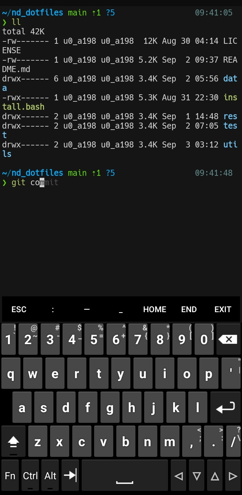

# 💥 Termux(Android)



[Termux](https://github.com/termux/termux-app) is an Android terminal emulator and Linux environment app that works directly with no rooting or setup required. A minimal base system is installed automatically - additional packages are available using the APT package manager.

## 📦 Installation

- Get it on [Github](https://github.com/termux/termux-app#github)
- Download from [F-Droid](https://f-droid.org/packages/com.termux/)

## ⌨️ Hacking

### 📂 File Structure

<pre>
~/.termux
  ├── colors.properties  # colorscheme
  ├── font.ttf           # font
  └── termux.properties  # terminal settings
</pre>

### ⚡️ Install Nerd Font

- Visit [Nerd Fonts](https://www.nerdfonts.com) and download your favourite font.

- Unzip it

  ```sh
  unzip my-favorite-font.zip
  ```

- Now you will see lots of .ttf and .otf file, rename any .ttf file into `font.ttf` and move it into `~/.termux` directory.

  ```sh
  mv my-favorite-font.ttf ~/.termux/font.ttf
  ```

- Run `termux-reload-settings` command or just open new session.

### ⚡️ Install Basic Packages

```sh
pkg update && pkg ugrade
pkg install x11-repo  # add X11-repo
pkg install termux-api termux-x11-nightly termux-tools man tree python git bvi wget neovim nodejs xsel sl file binutils texinfo figlet dateutils ncurses-utils fontconfig-utils
```

### ⚡️ Download Hacker's Keyboard

Download [Hacker's Keyboard](https://f-droid.org/en/packages/org.pocketworkstation.pckeyboard/)

## 🎨 Theme

[base16-termux](https://github.com/kdrag0n/base16-termux) - A set of Base16 scheme templates for the Termux terminal emulator app for Android.

## 👑 See Also

- [termux-desktop](https://github.com/adi1090x/termux-desktop)

- [termux-whatsapp-bot](https://github.com/RyzRdy/termux-whatsapp-bot)
